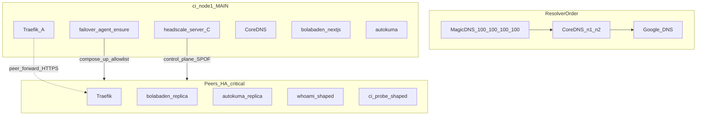

# feat: Zero-SPOF-honest failover CI hardening

## Goal Capsule

Make failover CI and prove gates **honest** about high availability: Tier-A apps (Traefik edge, bolabaden-nextjs, Autokuma, whoami/ci-probe canaries) survive wrong-tip and instance kill; Headscale control plane remains an **admitted SPOF** with a **fail-closed** prove; peers run an **HA-critical curated set** (image sync + `pull=never`), never a false “full stack ×4” claim.

**Authority:** This plan > feasibility checklist honesty rules > current README overclaims.  
**Stop when:** Expanded prove suite hard-fails without Tier-A peer backends / HS-down detection; README and GHA language match reality; `validate-local` still covers PR without DinD.

**Product Contract preservation:** Bootstrap from live review + feasibility checklist; no separate requirements-only artifact to preserve.

---

## Product Contract

### Summary

CI today can print `prove-failover ALL PASSED` while bolabaden has only a local Traefik URL, Autokuma is absent from failover YAML, peers run 3–5 containers, and Headscale is a single SQLite control plane. This plan closes the honesty gap and hardens Tier-A multi-node behavior without inventing dual-primary Headscale or 21GB×4 image clones.

### Requirements

- **R1.** Split prove outcomes so whoami/ci-probe alone cannot claim stack HA.
- **R2.** Tier-A apps (bolabaden-nextjs, Autokuma, whoami, ci-probe, Traefik) have peer Traefik backends when shape/ensure say they should run on peers.
- **R3.** `FAILOVER_REPLICA_ENSURE` on main is truthful: either compose-based ensure for an allowlist succeeds observably, or CI fails closed / documents routing-only mode.
- **R4.** Shape-placement intentional stops are never undone by replica ensure.
- **R5.** Headscale-server stays single-node; stopping it makes MagicDNS/join fail closed; suite must not soft-skip that gate.
- **R6.** Peer image strategy is curated critical allowlist + sync + `--pull=never`; logs assert no “full stack ×4”.
- **R7.** GHA: PR stays `validate-local`; full DinD mesh gets schedule + easier dispatch; summaries use honest language.
- **R8.** Autokuma either has Traefik/failover labels and Tier-A placement, or explicit `failover.managed=false` with documented exclusion (choose: **labels + Tier-A**).

### Actors

- **A1.** Operator running `arbitrary-scripts/failover-ci/run-all.sh`
- **A2.** failover-agent on `ci-node1` (placement authority + YAML writer)
- **A3.** GHA `Failover Mesh CI` jobs

### Key Flows

- **F1.** Tip Traefik (any node) → peer-forward HTTPS → Tier-A backend on another node
- **F2.** Shape marks probe services intentionally stopped → ensure skips those nodes
- **F3.** Kill Headscale-server → MagicDNS/join fail closed; CoreDNS edge path may still serve Tier-A
- **F4.** Image sync main→peers → critical `compose up --pull=never`

### Acceptance Examples

- **AE1.** After kill bolabaden on one peer, tip still returns 200 for bolabaden Host.
- **AE2.** After stop Traefik on n1, tip n4 still serves whoami + bolabaden + Autokuma HTTP route.
- **AE3.** After stop headscale-server, MagicDNS hard gate fails the suite (no soft-skip).
- **AE4.** Suite fails if `failover-fallbacks.yaml` has bolabaden with only `http://bolabaden-nextjs:3000` when peers should run it.
- **AE5.** PR CI runtime remains validate-local-only; scheduled/dispatch mesh runs expanded proves.
- **AE6.** After kill Autokuma on one peer, tip still returns HTTP 200 for the Autokuma Traefik Host (Kuma socket may be stubbed on DinD; prove is Traefik reachability + container plurality, not full Uptime Kuma UI).

### Scope Boundaries

**In scope:** failover-ci scripts/proves, agent eligibility/replica path for allowlist, Autokuma labels, image sync allowlist, GHA schedule/dispatch UX, README honesty.

**Out of scope / Outside this product's identity:** Dual-primary Headscale; stateful DB HA; production crowdsec/tinyauth continuity on DinD (stubs remain); Cloudflare live zone as hard gate.

### Deferred to Follow-Up Work

- Middleware/auth continuity proves on non-DinD backends
- Compose-up-on-peer for all eligible services (beyond Tier-A allowlist)
- OpenSVC dual-writer elimination beyond CI `OSVC_INGRESS_SYNC_DISABLE=1`

---

## Planning Contract

### Assumptions

- DinD host free disk stays roughly 25–40G; full image set ~21GB cannot be cloned to four nodes.
- Headscale HA via multi-primary is out of scope; honesty > fake HA.
- User confirmed “any and all” of the hardening package from the live review.
- Replica ensure via raw `ExportContainerConfig` is too fragile for CI (project network names / binds); Tier-A path uses **compose-up-on-peer** (or equivalent rewrite) for allowlisted services.

### Key Technical Decisions

1. **HA tiers A/B/C** — A multi-node ingress (Traefik, bolabaden, Autokuma, canaries); B DNS plurality (CoreDNS×2, MagicDNS priority); C admitted SPOF (headscale-server) with fail-closed prove.
2. **Peers = HA-critical curated set** — not full root compose success criterion; sync allowlist includes Traefik, whoami, ci-probe, failover-agent, headscale(+UI), CoreDNS, Autokuma, bolabaden-nextjs.
3. **Shape before ensure** — shape writes/observes `intentionally_stopped` for whoami/ci-probe/HS roles; ensure only on main; peers `FAILOVER_REPLICA_ENSURE=false`.
4. **Allowlist ensure** — prefer compose-on-peer for Tier-A over blanket ExportContainerConfig; fail CI if ensure fails for allowlisted services.
5. **Prove split** — `prove-failover` expands HARD gates; new `prove-headscale-spof.sh`; whoami-only cannot PASS the suite.
6. **GHA** — keep PR unit job; add `schedule` + easier dispatch defaults; job summary forbids “full stack HA” / “Headscale HA” wording.

### High-Level Technical Design

**Chaos → expected**

| Chaos | Expected |
|---|---|
| Kill Traefik n1 | Tip n4 still serves Tier-A |
| Kill bolabaden one peer | Other replica serves |
| Kill Autokuma one peer | Other replica / route still works |
| Stop headscale-server | MagicDNS/join FAIL closed; edge via CoreDNS may still work |
| Shape away whoami on n1 | Ensure does not recreate it |

### Alternatives Considered

- **Fake dual Headscale** — rejected; SQLite single authority; UI on n2 ≠ HA.
- **True full stack ×4** — rejected on disk; curated critical set instead.
- **Routing-only forever (ensure off)** — rejected for Tier-A; keep for media/stateful deny-list.

---

## Implementation Units

### U1. Honesty contract + peer critical allowlist

**Goal:** Peers documented and implemented as HA-critical curated set; ban full×4 / dual-HS language.  
**Requirements:** R6, R7  
**Dependencies:** none  
**Files:**
- `arbitrary-scripts/failover-ci/README.md`
- `arbitrary-scripts/failover-ci/sync-images-from-main.sh`
- `arbitrary-scripts/failover-ci/compose-up-critical-full.sh`
- `arbitrary-scripts/failover-ci/compose-up-all.sh`
- `arbitrary-scripts/failover-ci/lib.sh`
**Approach:** Extend sync critical allowlist with Autokuma + bolabaden images (bypass size cap). Update `compose-up-critical-full.sh` / peer branch of `compose-up-all.sh` forced `up` service lists to include `bolabaden-nextjs` and `autokuma` (not only Traefik/whoami/HS/agent/ci-probe). Peer up path remains `--pull=never` for that curated set. README topology + DinD sections state honesty bans.  
**Execution note:** Prefer runtime/log smoke over unit tests for sync list.  
**Test scenarios:**
- Sync list contains bolabaden-nextjs and autokuma image refs even when `FAILOVER_CI_IMAGE_MAX_MB=450`.
- Peer `docker compose … up --pull=never` for the expanded critical service list succeeds without Hub.
- Log/assert peer image count ≪ main full-stack image set.
**Verification:** README grep for banned phrases fails CI doc check or manual review; sync script and critical-up lists match.

### U2. Shape marks intentional stop for probes

**Goal:** Ensure never undoes whoami/ci-probe/HS shape.  
**Requirements:** R4  
**Dependencies:** U1  
**Files:**
- `arbitrary-scripts/failover-ci/shape-placement.sh`
- `infra/failover/agent.go` (or registry write path)
- `infra/failover/registry.go`
- `infra/failover/registry_test.go`
**Approach:** After shape stops a service, registry must show `intentionally_stopped` on that node before ensure loop; ensure already skips that status — make observation reliable (compose stop classification).  
**Test scenarios:**
- Covers R4: after shape+ensure, whoami absent on n1/n4 and registry status is intentionally_stopped.
- Ensure does not start whoami on n1 when shaped off.
**Verification:** R4 gate in prove or unit+integration assertion.

### U3. Tier-A compose-on-peer ensure (bolabaden + Autokuma)

**Goal:** Allowlisted services actually run on peers with peer URLs in YAML.  
**Requirements:** R2, R3, R8  
**Dependencies:** U1, U2  
**Files:**
- `infra/failover/replica.go`
- `infra/failover/replica_test.go`
- `infra/failover/eligibility.go`
- `infra/failover/eligibility_test.go`
- `compose/docker-compose.coolify-proxy.yml` (Autokuma labels)
- `docker-compose.yml` (bolabaden `failover.replica=true` if needed)
- `arbitrary-scripts/failover-ci/provision-test-env.sh`
- `compose/docker-compose.failover-agent.yml`
**Approach:** For CI allowlist, use compose project on peer (`COMPOSE_PROJECT_NAME=<peer>`) with `--pull=never` (suppress ImagePull on allowlist path) rather than ExportContainerConfig recreate. Fail agent health/CI if allowlist ensure fails. Headscale remains deny-listed. Autokuma gets `traefik.enable` + HTTP router labels; peer Autokuma uses CI stub socket/secrets so the container stays healthy enough for Traefik Host 200. **Placement:** bolabaden-nextjs + Autokuma must run on **n1 and at least two of {n2,n3,n4}** after ensure (shape does not stop them).  
**Execution note:** Add characterization tests around EnsureReplicas skip-on-intentional-stop before changing recreate path.  
**Test scenarios:**
- Eligible Autokuma/bolabaden → ensure attempts compose-up on peer missing the service.
- Intentionally stopped node skipped.
- Headscale never ensured.
- After ensure, YAML for bolabaden includes `https://bolabaden-nextjs.ci-nodeN.$DOMAIN` for a running peer.
- Ensure failure for allowlist surfaces non-zero / unhealthy (not silent log-only).
**Verification:** Live mesh: ≥2 peers run both apps; YAML not local-only; AE1/AE4/AE6.

### U4. Expand prove-failover (Tier-A chaos)

**Goal:** HARD gates for bolabaden, Autokuma, Traefik tip; fail if only whoami passes.  
**Requirements:** R1, R2  
**Dependencies:** U3  
**Files:**
- `arbitrary-scripts/failover-ci/prove-failover.sh`
- `arbitrary-scripts/failover-ci/compose/docker-compose.ci-probes.yml`
- `arbitrary-scripts/failover-ci/validate-local.sh` (bash -n only)
**Approach:** Add Host checks and kill matrices for bolabaden + Autokuma; assert peer URL presence in YAML for allowlist; keep existing whoami/ci-probe cases.  
**Test scenarios:**
- Covers AE1, AE2, AE4.
- Kill bolabaden on one peer → still 200 via tip.
- Kill Autokuma on one peer → still reachable.
- Stop Traefik n1 → tip n4 serves Tier-A.
- Missing peer URL in YAML → FAIL.
**Verification:** Deliberately local-only YAML fails prove; green only with peers.

### U5. Headscale SPOF fail-closed prove

**Goal:** Admit and prove control-plane SPOF.  
**Requirements:** R5  
**Dependencies:** U1  
**Files:**
- `arbitrary-scripts/failover-ci/prove-headscale-spof.sh` (new)
- `arbitrary-scripts/failover-ci/run-all.sh`
- `arbitrary-scripts/failover-ci/README.md`
**Approach:** Stop headscale-server; assert MagicDNS/join fail; restore; document that edge via CoreDNS may still work (split brain honesty). Never soft-skip when Tailscale was up.  
**Test scenarios:**
- Covers AE3.
- HS down → dig @100.100.100.100 fails or empty → suite FAIL if gate skipped.
- Soft-skip path removed for DinD when TS IP present.
**Verification:** Mesh job red when HS down and MagicDNS not asserted.

### U6. Prove-dns coverage for Tier-A names

**Goal:** CoreDNS answers node-direct for bolabaden/autokuma where placed (distinct from Traefik Host proves — DNS plurality honesty).  
**Requirements:** R2  
**Dependencies:** U3  
**Files:**
- `arbitrary-scripts/failover-ci/prove-dns.sh`
- `arbitrary-scripts/failover-ci/provision-coredns.sh`
- `arbitrary-scripts/failover-ci/coredns/Corefile.tmpl`
**Approach:** Extend zone generation for Tier-A FQDNs; prove dig @CoreDNS for global + node-direct A records matching `node-ips.json` / placement; keep Google isolation + MagicDNS hard gate.  
**Test scenarios:**
- CoreDNS A for bolabaden / autokuma global and node-direct match placement IPs.
- Google still must not return private mesh IPs.
- MagicDNS hard gate unchanged when TS up.
**Verification:** prove-dns FAIL if node-direct missing for nodes that run the service.

### U7. GHA schedule + easier full-mesh dispatch

**Goal:** Catch drift without PR tax; easier operator mesh run.  
**Requirements:** R7  
**Dependencies:** U4, U5  
**Files:**
- `.github/workflows/failover-mesh.yml`
- `arbitrary-scripts/failover-ci/README.md`
**Approach:** Add weekly cron for DinD `run-all.sh`. Keep `workflow_dispatch` with **`run_full_mesh` default `true`** (single checkbox to opt out). Job summary must not claim Headscale HA or full-stack×4. PR job unchanged.  
**Test scenarios:**
- Covers AE5.
- PR path still only validate-local.
- Schedule/dispatch invokes expanded proves including HS SPOF.
**Verification:** Workflow YAML review + dry dispatch on capable runner.

### U8. validate-local parity for new scripts/eligibility

**Goal:** Cheap PR regressions without DinD.  
**Requirements:** R1, R3  
**Dependencies:** U3, U5  
**Files:**
- `arbitrary-scripts/failover-ci/validate-local.sh`
- `infra/failover/eligibility_test.go`
- `infra/failover/replica_test.go`
**Approach:** bash -n all new prove scripts; extend Go tests for allowlist eligibility and intentional-stop skip; document that F*/H*/R* mesh gates require DinD.  
**Test scenarios:**
- bash -n includes new prove scripts.
- Unit: Autokuma/bolabaden eligibility; headscale denied; intentional stop skip.
**Verification:** `./validate-local.sh` green on ubuntu-latest.

---

## Verification Contract

| Gate | Command / outcome |
|---|---|
| PR | `arbitrary-scripts/failover-ci/validate-local.sh` |
| Mesh | `FAILOVER_CI_BACKEND=dind ./run-all.sh` — full prove order below |
| Honesty | Mesh FAIL if bolabaden YAML local-only while peers should run it; FAIL if MagicDNS soft-skipped with TS up |
| Disk | Peer critical sync succeeds; no requirement for full image clone |

**Mesh prove order** (`run-all.sh` after shape + Tier-A ready):

1. `prove-matrix.sh` — placement, registry R4, YAML peer URLs, tip×Host grid
2. `prove-dns.sh` — CoreDNS + MagicDNS hard gate + Tier-A FQDNs
3. `prove-production-dns.sh` — CF multi-A + favonia node-direct + Docker DNS parity
4. `prove-failover.sh` — deterministic Tier-A chaos (AE1/AE2/AE4/AE6)
5. `prove-chaos-random.sh` — seeded random chaos (`CHAOS_ROUNDS`, `CHAOS_SEED`, `CHAOS_DOUBLE`)
6. `prove-headscale-spof.sh` — Headscale admitted SPOF (AE3)
7. `prove-module5-ddns.sh` — Module 5 dry-run + CoreDNS cross-check

---

## Definition of Done

- [x] U1–U8 landed; README bans dual-HS and full-stack×4 claims
- [x] Live DinD mesh: AE1–AE4, AE6 + expanded proves green (`/tmp/failover-all-proves.log`, 2026-07-23)
- [ ] GHA DinD mesh: AE1–AE5 satisfied on scheduled or `workflow_dispatch` run
- [x] `FAILOVER_REPLICA_ENSURE` on main matches running agent; allowlist ensure failures fail the suite (`prove-matrix` / `wait-tier-a-ready` `/healthz`)
- [x] Headscale SPOF prove is HARD and wired into `run-all.sh`
- [x] PR CI still only validate-local; schedule/dispatch runs full mesh

---

## Risk Analysis

| Risk | Mitigation |
|---|---|
| ExportContainerConfig ensure thrash | Compose-on-peer allowlist only (U3) |
| Disk pressure syncing bolabaden/autokuma | Cap media images; critical allowlist only |
| Autokuma image/network deps on peers | Include in critical compose-up; fail closed if up fails |
| Operators overread green whoami | Suite structure + README (U1/U4) |
| Env drift ensure true/false | Prove asserts env == running container (U4/U8) |

---

## Sources & Research

- Live review (2026-07-18): n1≈57 / n2≈5 / n3–4≈3 containers; bolabaden YAML local-only; Autokuma unlabeled; prove whoami-only PASS
- Research subagent: prove matrix, code levers, false-confidence risks
- Architecture subagent: HA tiers, topology, chaos matrix, phased U1–U8
- Origin: `docs/brainstorms/20260718-failover-agent-feasibility-checklist.md` (must-not-claim list)
- Code: `infra/failover/eligibility.go`, `replica.go`, `arbitrary-scripts/failover-ci/prove-failover.sh`, `.github/workflows/failover-mesh.yml`
