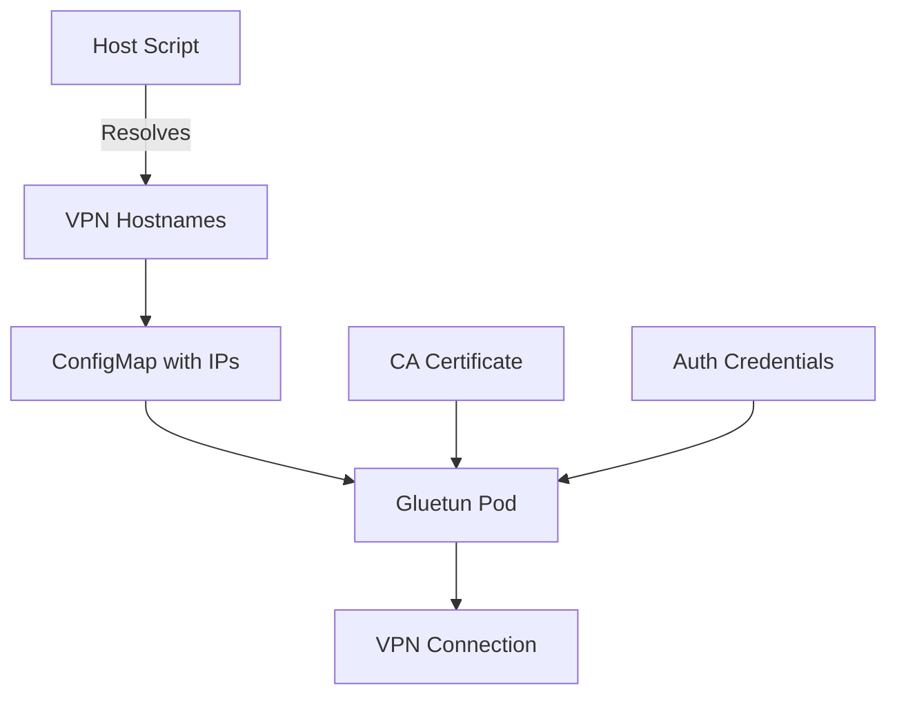

# VPN Gateway Kubernetes Deployment

This directory contains a complete Kubernetes deployment for VPN gateways using Gluetun with dynamic IP resolution for Premiumize VPN endpoints.

## 🎯 Overview

The VPN gateway system provides:

- **Dynamic IP Resolution**: VPN hostnames are resolved to IP addresses at deployment time, not cached
- **Multiple Country Support**: 18 different VPN endpoints across various countries
- **Kubernetes Native**: Full integration with ConfigMaps, Secrets, and Services
- **High Availability**: Easy scaling and health monitoring
- **Docker Compose Compatible**: Maintains compatibility with existing Docker setups

## 📁 Files Structure

```
k8s/bolabaden/
├── README.md                           # This documentation
├── deploy-vpn-gateway.sh               # Main deployment script
├── resolve-and-apply-vpn-configs.sh    # VPN hostname resolution script
├── vpn-ip-resolver-job.yaml           # Kubernetes Job for IP resolution (alternative)
├── gluetun-test.yaml                  # Test deployment (Finland)
├── gluetun-vpn-gateway.yaml           # Full production deployments
└── resolve-vpn-ips.yaml               # Legacy Job definition
```

## 🚀 Quick Start

### Prerequisites

1. **Kubernetes cluster** (k3s, kind, etc.)
2. **kubectl** configured and connected
3. **Premiumize account** with VPN access
4. **Valid credentials** in `configs/vpn-gateway/auth.conf`
5. **CA certificate** in `configs/vpn-gateway/premiumize-ca.pem`

### Basic Deployment

```bash
# Make deployment script executable
chmod +x deploy-vpn-gateway.sh

# Deploy the VPN gateway system
./deploy-vpn-gateway.sh deploy
```

### Alternative Commands

```bash
# Only resolve VPN IPs (useful for updates)
./deploy-vpn-gateway.sh resolve

# Check deployment status
./deploy-vpn-gateway.sh status

# Clean up all resources
./deploy-vpn-gateway.sh cleanup
```

## 🔧 Configuration

### 1. Premiumize Credentials

Update `../../configs/vpn-gateway/auth.conf`:

```
your_actual_premiumize_username
your_actual_premiumize_password
```

### 2. CA Certificate

Update `../../configs/vpn-gateway/premiumize-ca.pem` with the actual certificate from your Premiumize account.

### 3. Available VPN Endpoints

The system supports these countries:

- 🇦🇹 Austria (AT) - `vpn-at.premiumize.me`
- 🇦🇺 Australia (AU) - `vpn-au.premiumize.me`
- 🇧🇪 Belgium (BE) - `vpn-be.premiumize.me`
- 🇨🇦 Canada (CA) - `vpn-ca.premiumize.me`
- 🇨🇭 Switzerland (CH) - `vpn-ch.premiumize.me`
- 🇨🇿 Czech Republic (CZ) - `vpn-cz.premiumize.me`
- 🇩🇪 Germany (DE) - `vpn-de.premiumize.me`
- 🇪🇸 Spain (ES) - `vpn-es.premiumize.me`
- 🇫🇮 Finland (FI) - `vpn-fi.premiumize.me`
- 🇫🇷 France (FR) - `vpn-fr.premiumize.me`
- 🇬🇧 United Kingdom (GB) - `vpn-gb.premiumize.me`
- 🇬🇷 Greece (GR) - `vpn-gr.premiumize.me`
- 🇮🇹 Italy (IT) - `vpn-it.premiumize.me`
- 🇯🇵 Japan (JP) - `vpn-jp.premiumize.me`
- 🇳🇱 Netherlands (NL) - `vpn-nl.premiumize.me`
- 🇵🇱 Poland (PL) - `vpn-pl.premiumize.me`
- 🇸🇬 Singapore (SG) - `vpn-sg.premiumize.me`
- 🇺🇸 United States (US) - `vpn-us.premiumize.me`

## 🏗️ Architecture

### Dynamic IP Resolution Process

1. **Host-Side Resolution**: The `resolve-and-apply-vpn-configs.sh` script runs on the host
2. **DNS Lookup**: Uses `getent hosts` to resolve VPN hostnames to current IP addresses
3. **ConfigMap Generation**: Creates a Kubernetes ConfigMap with resolved OpenVPN configurations
4. **Container Deployment**: Gluetun containers use the resolved IPs from the ConfigMap

### Key Components



### Kubernetes Resources

- **ConfigMaps**:
  - `resolved-vpn-configs`: OpenVPN configs with resolved IPs
  - `vpn-ca-cert`: Premiumize CA certificate
  - `vpn-templates`: Original hostname-based configs (for Job approach)

- **Secrets**:
  - `vpn-auth`: Premiumize username/password

- **Deployments**:
  - `gluetun-test-fi`: Test instance (Finland)
  - `gluetun-vpn-gateway-*`: Production instances per country

- **Services**:
  - HTTP proxy on port 8080
  - Control server on port 8000
  - Shadowsocks on port 8888 (optional)

## 🔍 Monitoring & Troubleshooting

### Check Pod Status

```bash
kubectl get pods -l app=gluetun-test
```

### View Logs

```bash
kubectl logs -l app=gluetun-test --tail=50
```

### Test VPN Connection

```bash
# Port forward to access the proxy
kubectl port-forward svc/gluetun-test-fi 8080:8080

# Test in another terminal
curl -x http://localhost:8080 https://ipinfo.io/json
```

### Common Issues

1. **CA Certificate Error**: Ensure the CA certificate is valid and not a placeholder
2. **Auth Failure**: Check that credentials in `auth.conf` are correct
3. **DNS Resolution**: VPN hostnames must be resolvable from the host
4. **Sysctls**: Some k3s configurations may need additional sysctls configuration

### Debug Commands

```bash
# Check ConfigMaps
kubectl get configmap resolved-vpn-configs -o yaml

# Check mounted files in pod
kubectl exec -it <pod-name> -- ls -la /gluetun/

# Check OpenVPN config
kubectl exec -it <pod-name> -- cat /gluetun/custom.conf
```

## 🔄 Updates & Maintenance

### Refresh VPN IPs

VPN provider IP addresses change periodically. To update:

```bash
# Re-resolve all VPN hostnames
./deploy-vpn-gateway.sh resolve

# Restart pods to pick up new IPs
kubectl rollout restart deployment/gluetun-test-fi
```

### Add New Countries

1. Add hostname to the `HOSTNAMES` variable in `resolve-and-apply-vpn-configs.sh`
2. Create OpenVPN config file in `configs/vpn-gateway/`
3. Add deployment in `gluetun-vpn-gateway.yaml`
4. Re-run the deployment script

## 🐳 Docker Compose Compatibility

This Kubernetes setup maintains compatibility with the original Docker Compose configuration. The resolved IP addresses are the same ones that would be used in Docker Compose with the same hostname resolution.

### Migration from Docker Compose

1. Export existing configs: `docker-compose config > docker-compose-resolved.yml`
2. Note any custom environment variables or volumes
3. Update the Kubernetes deployments with equivalent settings
4. Deploy using the provided scripts

## 🔐 Security Considerations

- **Credentials**: Stored as Kubernetes Secrets (base64 encoded)
- **Network Policies**: Consider implementing network policies for pod isolation
- **Resource Limits**: CPU and memory limits are configured to prevent resource exhaustion
- **Non-Root**: Gluetun runs as non-root user (UID 1000)
- **Capabilities**: Only NET_ADMIN capability is granted (minimal required permissions)

## 📊 Performance & Scaling

### Resource Requirements

- **CPU**: 100m request, 500m limit per pod
- **Memory**: 64Mi request, 256Mi limit per pod
- **Network**: Requires access to /dev/net/tun

### Scaling

```bash
# Scale a specific deployment
kubectl scale deployment gluetun-test-fi --replicas=3

# Auto-scaling (if HPA is configured)
kubectl autoscale deployment gluetun-test-fi --cpu-percent=80 --min=1 --max=5
```

## 🆘 Support

### Logs Location

All logs are available through kubectl:

```bash
kubectl logs -l app=gluetun-test -f
```

### Health Checks

Gluetun provides built-in health checks:

- **Liveness Probe**: HTTP check on port 8000
- **Readiness Probe**: HTTP check on port 8000
- **Health Check Endpoint**: `http://pod-ip:8000/`

### Getting Help

1. Check the [Gluetun documentation](https://github.com/qdm12/gluetun)
2. Review Kubernetes events: `kubectl get events --sort-by=.metadata.creationTimestamp`
3. Check node resources: `kubectl top nodes` and `kubectl top pods`

## 📝 License

This deployment configuration is provided as-is for educational and operational purposes. Please ensure compliance with your VPN provider's terms of service.
